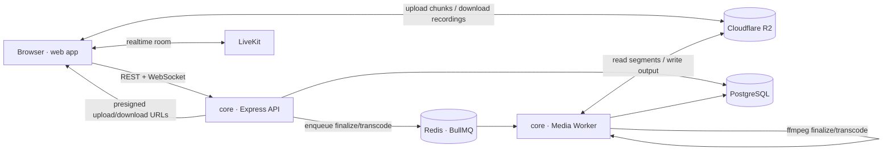

<div align="center">

<picture>
  <source media="(prefers-color-scheme: dark)" srcset="web/public/logo/logo-dark.png">
  <source media="(prefers-color-scheme: light)" srcset="web/public/logo/logo-light.png">
  
</picture>

### OPENSIDE

**Openside** is an open-source, self-hostable recording studio - capture high-quality meetings, podcasts, and screen recordings with multi-track, per-participant recording, then finalize them into clean, downloadable video.

[](LICENSE)
[](#getting-started-local-dev)
[](#contributing)


</div>

---

## Features

- **Studio-quality recording** - crisp video up to 4K with clear, high-quality audio
- **Multi-track, per-participant output** - each speaker on their own track, ready to edit
- **Screen recorder** - quick standalone screen and camera capture, share it with a link
- **Shareable recordings** - share any recording from your projects with a link
- **Export in any format** - download your recordings as MP4, WebM, MP3, or WAV
- **Cheaper than SaaS** - no per-seat fees, pay only for the infra you use
- **Use it for free** - connect your own LiveKit and storage in settings to unlock unlimited, watermark-free recording at no cost beyond your own usage
- **Open source & self-hostable** - MIT licensed, no vendor lock-in

---

## Architecture

Openside is **two apps, three deployable processes** - a frontend, an API server, and a media worker (the API and worker share the same `core` codebase, run as separate processes).



| Piece | Folder | What it does |
|-------|--------|--------------|
| **Web** | [`web/`](web) | React 19 + Vite SPA. Recording UI, meeting rooms, dashboard, library. |
| **API** | [`core/`](core) (`src/index.ts`) | Express server: auth, spaces, recording sessions, LiveKit tokens, billing, presigned downloads. |
| **Worker** | [`core/`](core) (`src/worker.ts`) | BullMQ consumer running the heavy `ffmpeg` work - session finalization + on-demand transcodes - **off** the API. |

> The worker shares `core`'s Prisma schema, queue definitions, and services with the API, so it's the **same build, a different entrypoint** - no separate repo needed. Scale it horizontally by running more worker instances.

---

## Tech Stack

**Frontend** - React 19 · Vite · TypeScript · Tailwind · TanStack Query · Framer Motion · LiveKit components · Clerk

**Backend (`core`)** - Node · Express 5 · TypeScript · Prisma 7 (PostgreSQL) · BullMQ + Redis · LiveKit Server SDK · `ffmpeg-static` · AWS S3 SDK (R2) · Socket.IO · Clerk · Nodemailer · Polar (billing)

---

## Getting Started (Local Dev)

### Prerequisites

- **Node.js** 20+ and **pnpm** 10+ (`corepack enable`)
- **PostgreSQL** database
- **Redis** (required for the worker / media pipeline)
- A **LiveKit** project (cloud or self-hosted)
- A **Cloudflare R2** bucket (S3-compatible) for output storage
- A **Clerk** application for auth

### 1. Clone & install

```bash
git clone https://github.com/rinkitadhana/openside.git
cd openside

# Backend + worker
cd core && pnpm install

# Frontend
cd web && pnpm install
```

### 2. Configure environment

Copy the example env files and fill in your own values:

```bash
cp core/.env.example core/.env.local
cp web/.env.example  web/.env.local
```

Each key is documented in the `.env.example` files. The app loads `.env.local` for local development and `.env.production` when hosted (`NODE_ENV=production`), so create a `.env.production` with your production values when deploying.

### 3. Set up the database

```bash
cd core
pnpm db:generate     # generate Prisma client
pnpm db:migrate      # apply migrations
pnpm db:seed         # optional: seed data
```

### 4. Run everything

```bash
# Terminal 1 - API server
cd core && pnpm dev

# Terminal 2 - media worker (needs REDIS_URL)
cd core && pnpm worker:dev

# Terminal 3 - frontend
cd web && pnpm dev
```

Open the Vite dev URL (default http://localhost:3000) and you're in.

---

## Contributing

Issues and PRs are always welcome. Before opening a PR, test your changes properly, and include screenshots plus the reasoning behind it so it's clear why the change is worth merging.

---

## License

Released under the [MIT License](LICENSE). Free to use, modify, and self-host.
